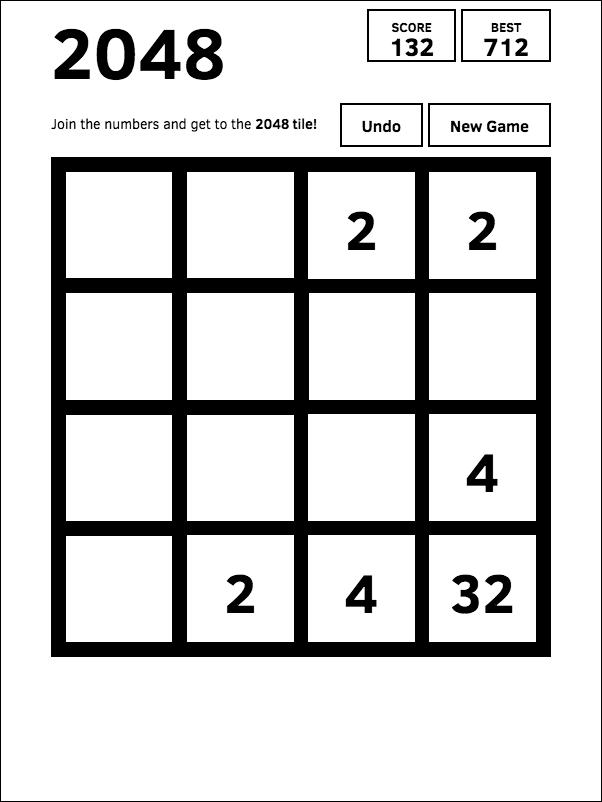

# 2048

A black & white themed fork of [uberspot's 2048](https://github.com/uberspot/2048) which itself is a fork of [gabrielecirulli's 2048](https://github.com/gabrielecirulli/2048).

Made just for fun. [Play it here!](http://chenziteng.github.io/2048/)

### Kindle

The theme fits eink display, and if you want to play it on your Amazon Kindle E-reader then,

* Simply visit http://chenziteng.github.io/2048/ by the built-in browser, or if you are too lazy to key in the long address, then
* [Download this book](https://github.com/chenziteng/2048/blob/gh-pages/book/2048.mobi) and sideload it to the device, and then open the book and tap the hyperlink 2048 to start the game.

Tip: some Kindle devices their browser doesn't supports swipe gesture, in this case try to tap the outermost cells to move, i.e. if we index the cells from left to right and top-down, assume that the indexing is zero-based, then
* tap cell1/cell2 to move up,
* tap cell4/cell8 to move left,
* tap cell7/cell11 to move right,
* tap cell13/cell14 to move down

### Screenshot

## License

2048 is licensed under the [MIT license.](https://github.com/gabrielecirulli/2048/blob/master/LICENSE.txt)